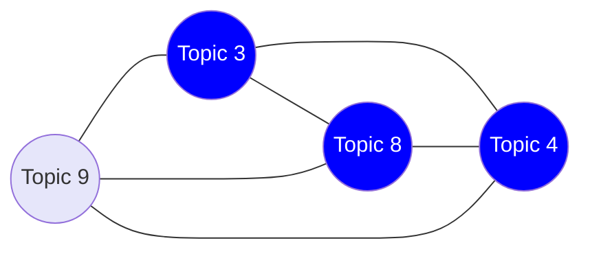
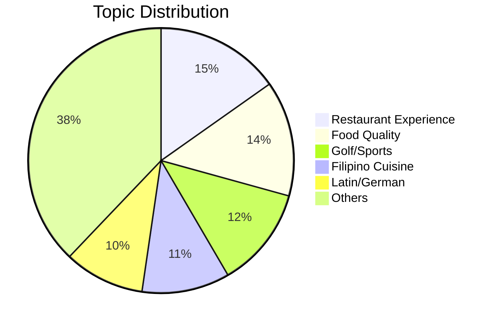
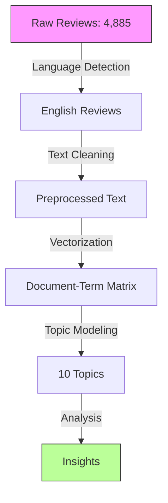
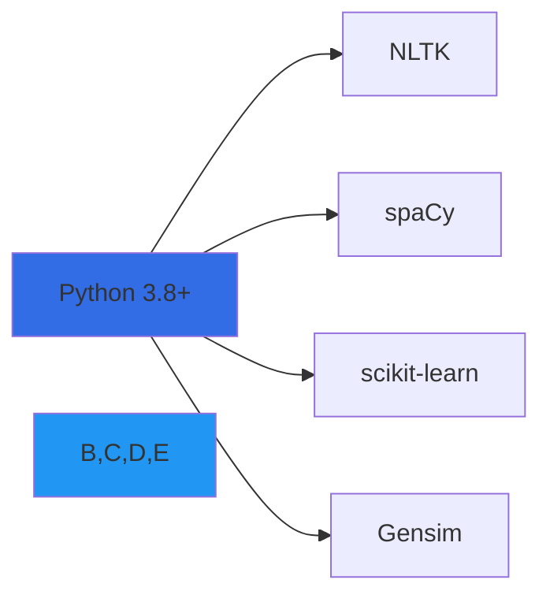

# Topic Modeling Analysis of Yelp Reviews

<div align="center">

```
          ⚡ 
         ⚡⚡
        ⚡⚡⚡
       ⚡⚡⚡⚡
      ⚡⚡⚡⚡⚡
     ⚡⚡⚡⚡⚡⚡
    ⚡⚡⚡⚡⚡⚡⚡
   ▀▀▀▀▀▀▀▀▀▀▀
```


*Unveiling Hidden Patterns in Customer Reviews Using Advanced NLP*

</div>

## 📊 Project Overview

Analysis of 4,885 Yelp reviews using topic modeling to uncover hidden patterns and themes in customer feedback. Through LDA (Latent Dirichlet Allocation), NMF, and LSA approaches, we identify key discussion topics and their relationships.

## 🔍 Key Findings

### Topic Distribution Network



### Word Frequency Analysis

```
Most Frequent Terms in Reviews
────────────────────────────────────────
good    ████████████████████████  2546
great   ██████████████████████   2083
service ████████████████████     1939
time    ███████████████████      1697
back    ████████████████         1349
order   ███████████████          1287
chicken ██████████████           1078
pizza   ████████████              974
also    ███████████               875
came    ███████████               851
```

### Topic Composition



## 📈 Model Performance

### Coherence Scores
```
Model Evaluation Metrics
─────────────────────────────────────
LDA  │████████████▌│ Score: 0.513
NMF  │████████████▌│ Score: 0.512
LSA  │██████████▌  │ Score: 0.445
─────────────────────────────────────
```

### Topic Stability
```python
Stability Scores:
┌─────────┬────────────┬───────────┐
│ Model   │ Stability  │ Variance  │
├─────────┼────────────┼───────────┤
│ LDA     │ 0.627      │ ±0.021    │
│ NMF     │ 0.712      │ ±0.072    │
│ LSA     │ 0.684      │ ±0.070    │
└─────────┴────────────┴───────────┘
```

## 🛠️ Implementation

### Processing Pipeline


### Vocabulary Statistics
```
Unique Terms Analysis
──────────────────────────────
Unigrams  │██████████│ 12,910
Bigrams   │██████████│ 141,718
Trigrams  │██████████│ 189,469
──────────────────────────────
```

## 🔬 Key Insights

1. **Topic Distribution**
   ```
   Most Prevalent Topics
   ────────────────────────────────────
   Restaurant Experience ████████ 15.2%
   Food Quality        ███████  14.1%
   Golf/Sports        ██████   12.3%
   Filipino Cuisine   ██████   10.7%
   Latin/German       █████     9.8%
   ────────────────────────────────────
   ```

2. **Common Bigrams**
   ```mermaid
   graph LR
       A[first time] --- B[come back]
       B --- C[customer service]
       C --- D[great service]
       D --- E[highly recommend]
   ```

## 👤 Author

<div align="center">

### Mohamed Amine EL MOUSSAOUI

[](https://www.linkedin.com/in/medaminelmoussaoui/)
[](https://github.com/MOSSAWIII)

</div>

## 📚 Technologies Used



## 📈 Future Improvements

- [ ] Implementation of dynamic topic modeling
- [ ] Integration of sentiment analysis
- [ ] Development of interactive visualizations
- [ ] Enhanced topic interpretation guidelines

---

<div align="center">

Made with 💻 by Mohamed Amine EL MOUSSAOUI

*If you found this project helpful, please consider giving it a ⭐*

</div>
