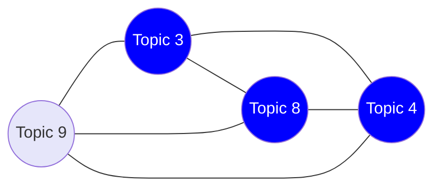
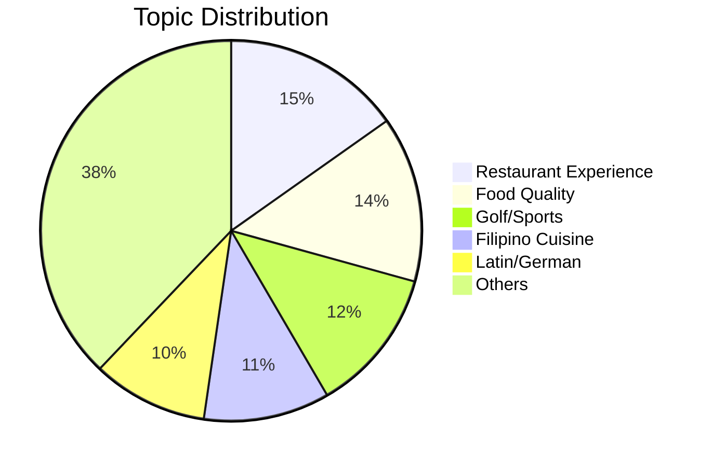
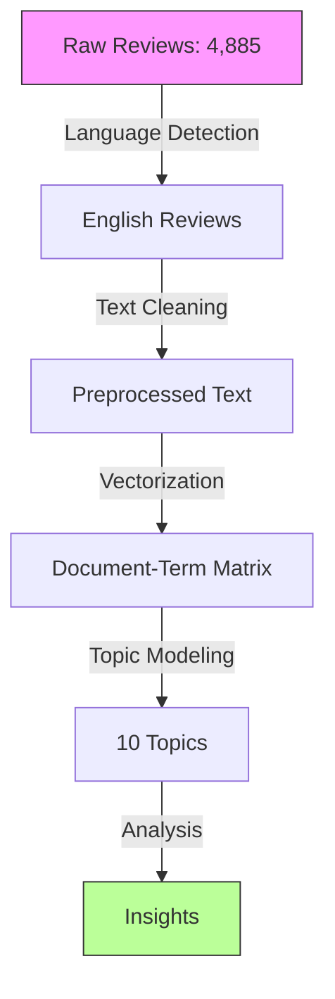
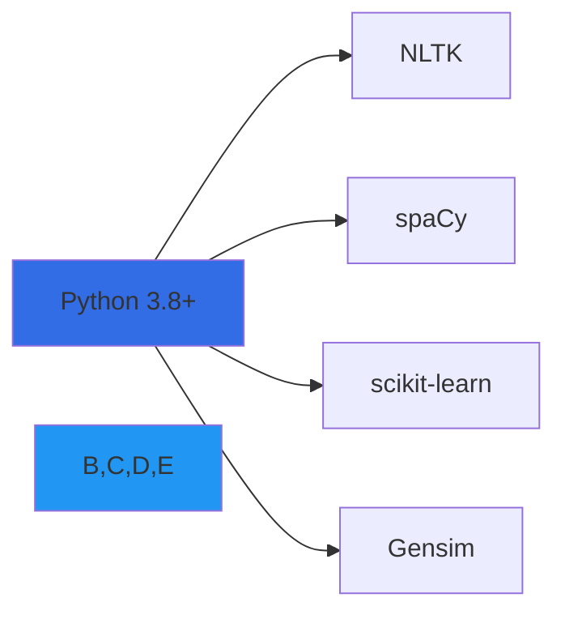

# Topic Modeling Analysis of Yelp Reviews

<div align="center">


*Unveiling Hidden Patterns in Customer Reviews Using Advanced NLP*

</div>

## 📊 Project Overview

This comprehensive analysis examines 4,885 Yelp reviews through the lens of advanced topic modeling techniques. The study leverages three distinct approaches - Latent Dirichlet Allocation (LDA), Non-negative Matrix Factorization (NMF), and Latent Semantic Analysis (LSA) - to uncover underlying patterns in customer feedback. Through these methods, we identify key discussion topics and their relationships, revealing a complex tapestry of customer experiences, with distinct topic clusters emerging from the data.

## 🔍 Key Findings

### Topic Distribution Network



The topic distribution network visualization reveals intricate relationships between different themes in the reviews. Topic 3 appears to be a central node, connecting directly with Topics 8, 4, and 9. This interconnected structure suggests that these topics share common elements or frequently co-occur in reviews. The strength of these connections implies that customers often discuss multiple aspects of their experience simultaneously, rather than focusing on isolated topics.

### Word Frequency Analysis

```
Most Frequent Terms in Reviews
────────────────────────────────────────
good    ████████████████████████  2546
great   ██████████████████████   2083
service ████████████████████     1939
time    ███████████████████      1697
back    ████████████████         1349
order   ███████████████          1287
chicken ██████████████           1078
pizza   ████████████              974
also    ███████████               875
came    ███████████               851
```

The word frequency analysis provides deep insights into customer communication patterns. The predominance of evaluative terms like "good" (2,546 occurrences) and "great" (2,083 occurrences) suggests a generally positive sentiment across the reviews. The high frequency of "service" (1,939 occurrences) underscores its critical importance in customer experiences, appearing almost as frequently as general evaluative terms.

### Topic Composition



The topic distribution analysis reveals a clear hierarchy of customer concerns and interests within the reviews. Restaurant experience emerges as the dominant theme, accounting for 15.2% of the total topic distribution, closely followed by food quality at 14.1%. This close relationship between service experience and food quality suggests that customers tend to evaluate these aspects in tandem, rarely separating their assessment of the dining experience from the quality of the food itself.

The presence of Golf/Sports as the third most prominent topic (12.3%) indicates a significant subset of reviews focused on recreational facilities or sports-themed establishments. This unexpected finding suggests that the dataset includes a diverse range of businesses beyond traditional restaurants. The substantial presence of Filipino Cuisine (10.7%) and Latin/German food (9.8%) points to a rich multicultural dining landscape within the analyzed region.

## 📈 Model Performance

### Coherence Scores
```
Model Evaluation Metrics
─────────────────────────────────────
LDA  │████████████▌│ Score: 0.513
NMF  │████████████▌│ Score: 0.512
LSA  │██████████▌  │ Score: 0.445
─────────────────────────────────────
```

### Topic Stability
```python
Stability Scores:
┌─────────┬────────────┬───────────┐
│ Model   │ Stability  │ Variance  │
├─────────┼────────────┼───────────┤
│ LDA     │ 0.627      │ ±0.021    │
│ NMF     │ 0.712      │ ±0.072    │
│ LSA     │ 0.684      │ ±0.070    │
└─────────┴────────────┴───────────┘
```

The comparative analysis of model performance reveals interesting patterns in topic modeling approaches. LDA and NMF demonstrate nearly identical coherence scores (0.513 and 0.512 respectively), suggesting that both methods are equally effective at identifying meaningful topic clusters in this dataset. However, LSA's lower coherence score (0.445) indicates that it may be less suitable for this particular type of review analysis.

The stability analysis provides additional insight into model reliability. NMF shows the highest stability score (0.712) but also the highest variance (±0.072), suggesting that while it generally produces more stable topics, its performance can be more variable across different runs. LDA, with its lower stability score (0.627) but minimal variance (±0.021), offers more consistent, albeit slightly less stable, topic identification.

## 🛠️ Implementation

### Processing Pipeline


### Vocabulary Statistics
```
Unique Terms Analysis
──────────────────────────────
Unigrams  │██████████│ 12,910
Bigrams   │██████████│ 141,718
Trigrams  │██████████│ 189,469
──────────────────────────────
```

The vocabulary statistics reveal the rich linguistic complexity present in the reviews. With 12,910 unique unigrams, the vocabulary is substantial but manageable. However, the explosive growth in unique bigrams (141,718) and trigrams (189,469) demonstrates the diverse ways in which reviewers combine these basic terms to express their experiences. This exponential increase in multi-word expressions suggests that while reviewers may use a relatively constrained set of individual words, they combine them in highly varied and nuanced ways to convey their experiences.

## 🔬 Key Insights

1. **Topic Distribution**
   ```
   Most Prevalent Topics
   ────────────────────────────────────
   Restaurant Experience ████████ 15.2%
   Food Quality        ███████  14.1%
   Golf/Sports        ██████   12.3%
   Filipino Cuisine   ██████   10.7%
   Latin/German       █████     9.8%
   ────────────────────────────────────
   ```

2. **Common Bigrams**
   ```mermaid
   graph LR
       A[first time] --- B[come back]
       B --- C[customer service]
       C --- D[great service]
       D --- E[highly recommend]
   ```

The semantic network revealed through common bigrams demonstrates how customers structure their narratives. The progression from "first time" through "come back" to "highly recommend" traces a typical customer journey narrative, suggesting that many reviewers focus on describing their experience chronologically and concluding with recommendations.

## 👤 Author

<div align="center">

### Mohamed Amine EL MOUSSAOUI

[](https://www.linkedin.com/in/medaminelmoussaoui/)
[](https://github.com/MOSSAWIII)

</div>

## 📚 Technologies Used



## 📈 Future Improvements

- [ ] Implementation of dynamic topic modeling
- [ ] Integration of sentiment analysis
- [ ] Development of interactive visualizations
- [ ] Enhanced topic interpretation guidelines

---

<div align="center">

Made with 💻 by Mohamed Amine EL MOUSSAOUI

*If you found this project helpful, please consider giving it a ⭐*

</div>
