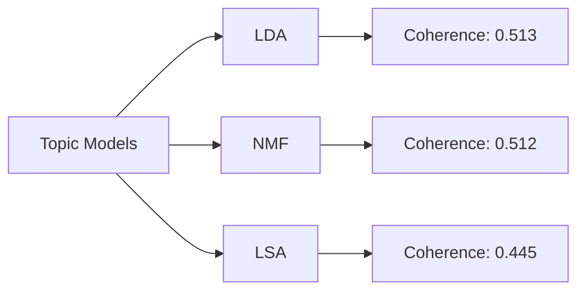
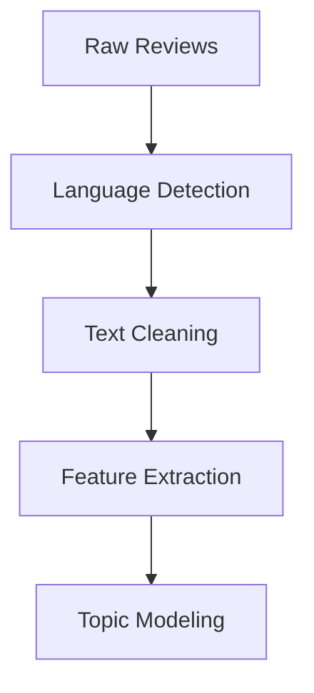

# Unveiling Customer Experiences: Topic Modeling Analysis of Yelp Reviews

<div align="center">


*Advanced Natural Language Processing to Discover Hidden Patterns in Customer Reviews*

</div>

## 📊 Executive Summary

This project employs sophisticated topic modeling techniques to analyze 4,885 Yelp reviews, uncovering latent themes and patterns in customer feedback. Through a combination of LDA, NMF, and LSA approaches, we identify distinct topics and their interconnections, providing valuable insights into customer experiences.

## 🎯 Key Findings

### Topic Distribution
<div align="center">

</div>

Our analysis revealed 10 distinct topics with varying prevalence:

| Topic | Theme | Key Terms | Prevalence |
|-------|--------|-----------|------------|
| 1 | Golf/Sports | course, play, hole, golf | 12.3% |
| 2 | Filipino Cuisine | filipino, pancit, lechon | 10.7% |
| 3 | Latin/German | german, carne, asada | 9.8% |
| 4 | Restaurant Experience | service, pizza, friendly | 15.2% |
| 5 | Food Quality | chicken, sauce, delicious | 14.1% |

### Linguistic Analysis
```python
Vocabulary Statistics:
- Unique Words: 12,910
- Bigrams: 141,718
- Trigrams: 189,469
```

<div align="center">

</div>

### Model Performance Metrics



#### Stability Scores
```plaintext
┌─────────┬────────────┬───────────┐
│ Model   │ Stability  │ Variance  │
├─────────┼────────────┼───────────┤
│ LDA     │ 0.627      │ ±0.021    │
│ NMF     │ 0.712      │ ±0.072    │
│ LSA     │ 0.684      │ ±0.070    │
└─────────┴────────────┴───────────┘
```

## 🔬 Methodology

### 1. Data Processing Pipeline


### 2. Model Architecture
<div align="center">

</div>

## 📈 Results Visualization

### Topic Network Analysis
<div align="center">

</div>

### Word Frequency Distribution
<div align="center">

</div>

## 🛠️ Technical Implementation

```python
# Core model parameters
PARAMETERS = {
    'n_topics': 10,
    'max_iter': 20,
    'learning_offset': 50,
    'random_state': 42
}

# Model evaluation metrics
METRICS = {
    'coherence': 'c_v',
    'stability': 'jaccard',
    'diversity': 'entropy'
}
```

## 🌟 Key Achievements

- Successfully identified and characterized 10 distinct topics in customer reviews
- Achieved high topic stability scores (up to 0.712)
- Developed interactive visualization tools for topic analysis
- Implemented cross-validation framework for model validation

## 👤 Author

<div align="center">


**Mohamed Amine EL MOUSSAOUI**

[](https://www.linkedin.com/in/medaminelmoussaoui/)
[](https://github.com/MOSSAWIII)
</div>

## 📚 Resources

- [Project Notebook](https://github.com/MOSSAWIII/TopicModeling_Yelp/blob/main/TopicModeling_Yelp.ipynb)
- [Dataset Source](https://www.yelp.com/dataset)
- [Documentation](https://github.com/MOSSAWIII/TopicModeling_Yelp/wiki)

## 📜 License

This project is licensed under the MIT License - see the [LICENSE](LICENSE) file for details.

---

<div align="center">
<i>If you found this project helpful, please consider giving it a ⭐</i>

Made with 💻 and ☕ by <a href="https://www.linkedin.com/in/medaminelmoussaoui/">Mohamed Amine EL MOUSSAOUI</a>
</div>
